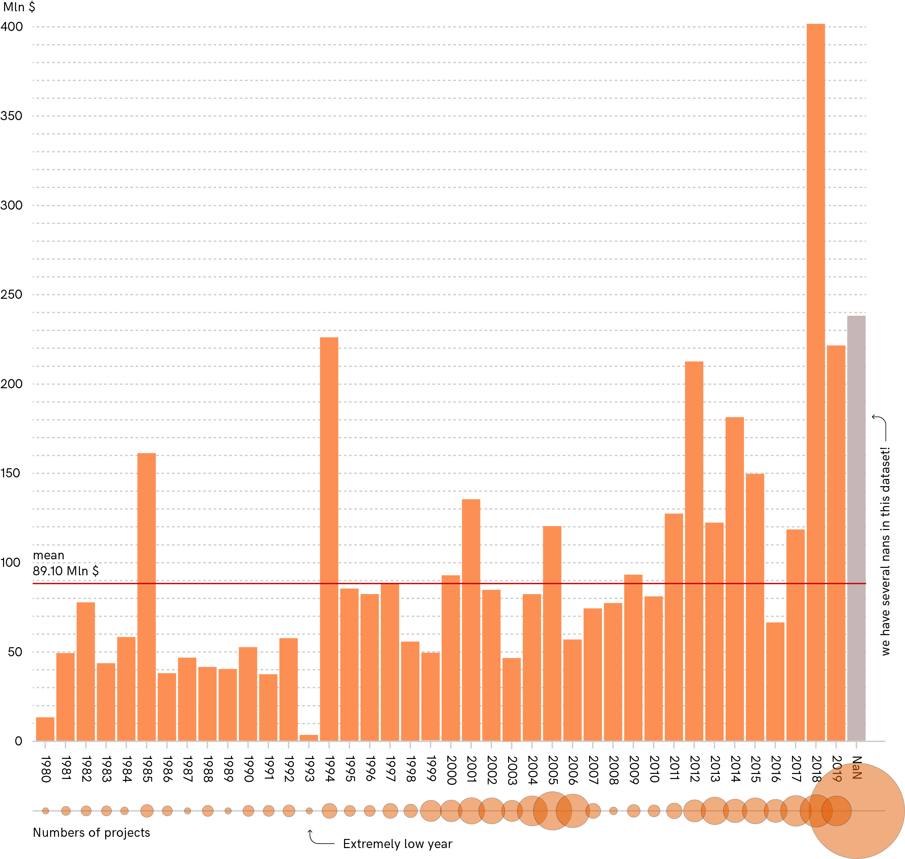

## taz + fhp - Money Flows

#### Funding strategies: time development in providing funds, funding strategies, missing data

There are interesting dates that mark possible changes in the way funds are allocated:
- adoption of Millenium Development Goals **2010**
- acknowledgment of clean water and sanitation as a human right by the UN General assembly in **2010**
- adoption of the Sustainable Development Goals in **2015**
- the new Water strategy of the Federal Ministry for Economic Cooperation and Development (BMZ) in **2017**

We can take a look more broadly to how the situation developed over time by observing the number of fundings and projects for each year, starting from the beginning of the dataset.

We see spikes in 1994, 2001, 2012 and 2018.
We see negative trends in 1993, 2003 and 2006.
Generally we see a positive trend: funding is more consistent year after year. So it goes also for the numbers of projects, which become higher as years pass by.

#### Relevant questions:
- The large number of projects with missing information raises a question: how do we know that the trend is in fact positive? What if we are missing key datapoints in relevant years?
- What happened in 2018? Is it correlated with the new Water strategy of the Federal Ministry for Economic Cooperation and Development (BMZ)?

---

To partially answer the second question we can plot projects distribution over time and see its evolution.

We have four major observations that can be done:

1. We have no information on donors for projects between 19750 and 2005.
2. If we look at India in the period within 2010 and 2018 it's noticeable how funding increased not only in terms of money quantity, but also in absolute terms with a galaxy of small projects being activated.
3. The funding strategy changes over year. Central Government has a central role after 2015, also university and research related projects increase.
4. We still have a considerable amount of projects with no date information, Tanzania and Uganda especially

#### Relevant questions:
- To what extent our data are complete and trustable?
- How many entries are missing crucial information?
- Why donors change over time? Is it connected to the types of projects that get funding?

---

At this point it's important to define to which extent we have incomplete entries in our data.

If we calculate the percentage of entries with missing information we have countries such Sudan and Uganda where almost 75% of the entries are incomplete. Other countries are "behaving" better with lower percentages of data loss.

#### Relevant questions:
- Why do we have incomplete entries? Are we looking at old projects that got incorrectly entered in the database?
- Why some countries have higher percentages of missing entries?
