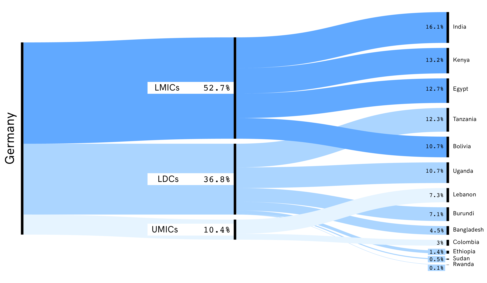
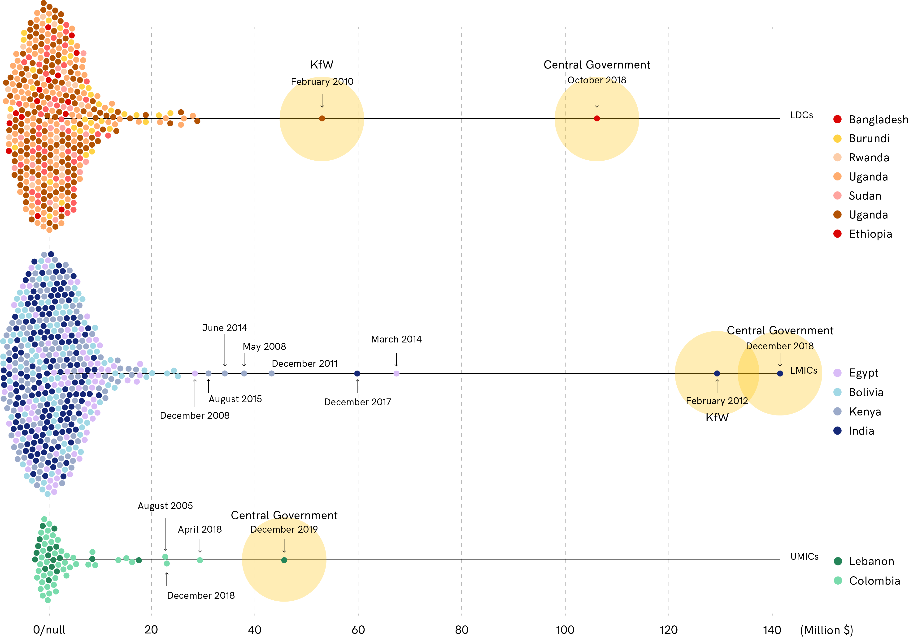

## taz + fhp - Money Flows

#### What we know so far:
There is a money pipeline.Funds go in all the way to the end point people it should help, through all these different actors (GIZ, consulting agencies, NGOs) which also get different percentagea of the money. We know certain countries activated more projects and/or received more moneys than others.

We are considering these countries:
- Uganda
- Kenya
- Tanzania
- Ethiopia
- Sudan
- South Sudan
- Rwanda
- Burundi
- India
- Bangladesh
- Lebanon
- Egypt
- Colombia
- Bolivia

India, Kenya and Egypt are the ones benefitting the most. In general LMICs countries are getting basically half the money from 1980.

#### Relevant questions:
- Why certain countries are not benefitting this largely from funding?
- What kinds of projects are more likely to be funded?
- Is there a connection between project's description/category and the amount of allocated money?

----

We have a very wide range of "Middleman" institutions providing the money. KfW is the major one, followed by Governmental institutions, NGOs and research/university institutions.

#### Relevant questions:
- What is the role of these institutions?
- Who are the local contractors involved?
- How do companies perform works on the area?

----

If we look at the distribution of individual projects in terms of money, we are immediately confronted with outliers. We have an handful of projects between 2012 and 2018 that have been granted considerable money.
India, Bandladesh, Egypt, Ethiopia and Lebanon are the countries that received this money.

Again it's interesting to see how:
- The majority of projects receive a fairly fixed amount of money (usually between 20 and 40 MLN/euro).
- Large funding is dispensed by major institutions (such as Central Goverment and KfW)
- Countries such as Bolivia benefitted largely from funding, but for small projects.
- India benefitted less in terms of absolute number of projects, but got way more money on single initatives.

#### Relevant questions:
- What are the outlying projects?
- For countries with a considerable amount of smaller projects: would it be possible to geo-locate them?
