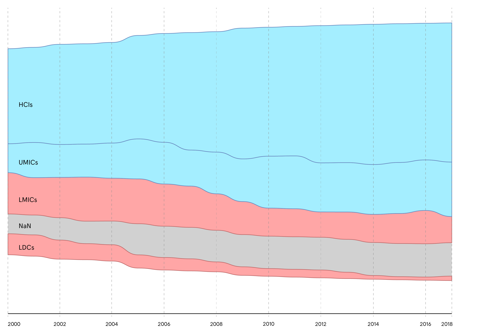
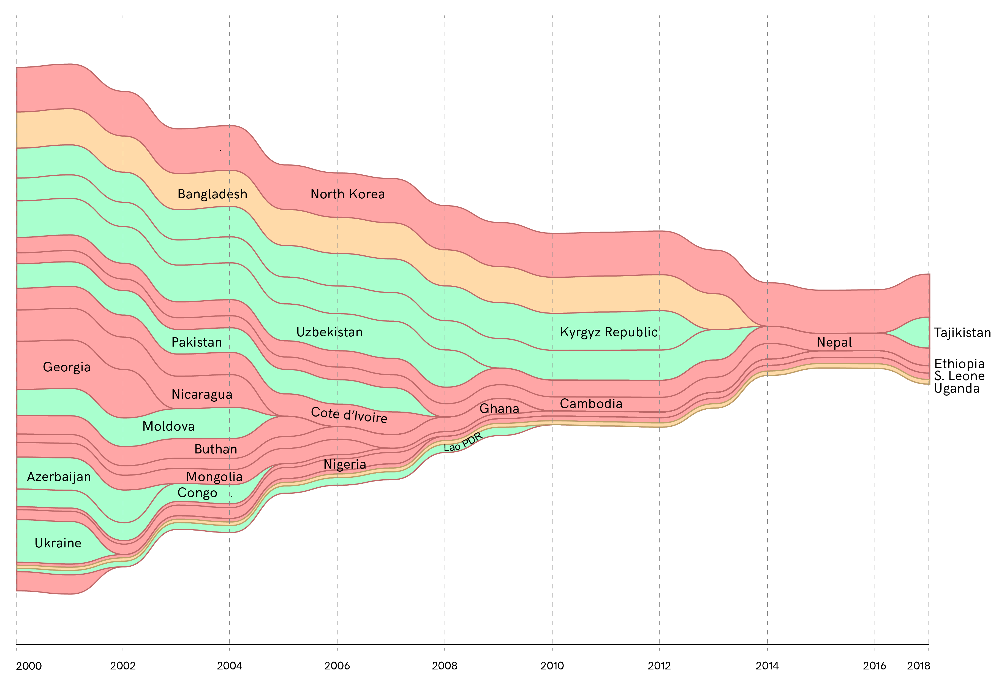
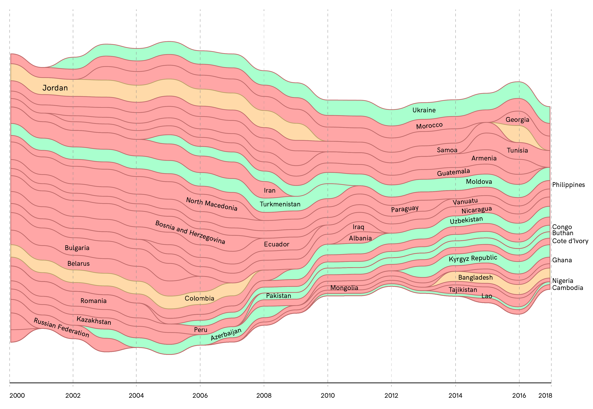

## taz + fhp - Money Flows

#### Tell me about: Millennium Development Goals
(For data and analysis refer to this [Python Notebook](../ipynb_notebooks/02.tellmeabout_MillenniumDevelopmentGoals.ipynb))
We import Millenium Development Goals data from the World Bank API to check if the access to clean and safe water develops over time.

#### How many people have access to safely managed water sources?

The overall trend is positive. LMICs and LDCs (in red) suffered decreasing access to safe water in the last two decades. HCIs and UMICs (in light blue) are performing better. Below two in-depth focuses on the interested countries.

##### LMICs

##### LDCs

In yellow all the countries in our list. In green all the countries appearing in both groups. We can see that LMICs shrinked considerabily, while LDCs suffered relatively.
